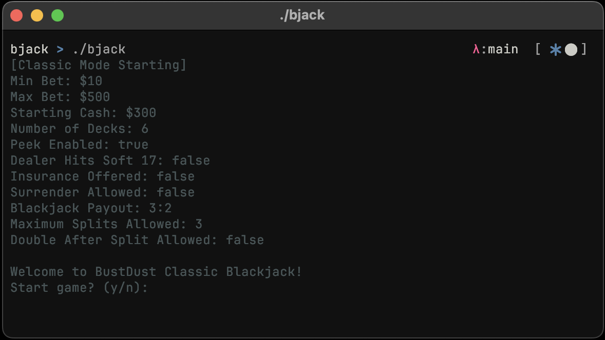
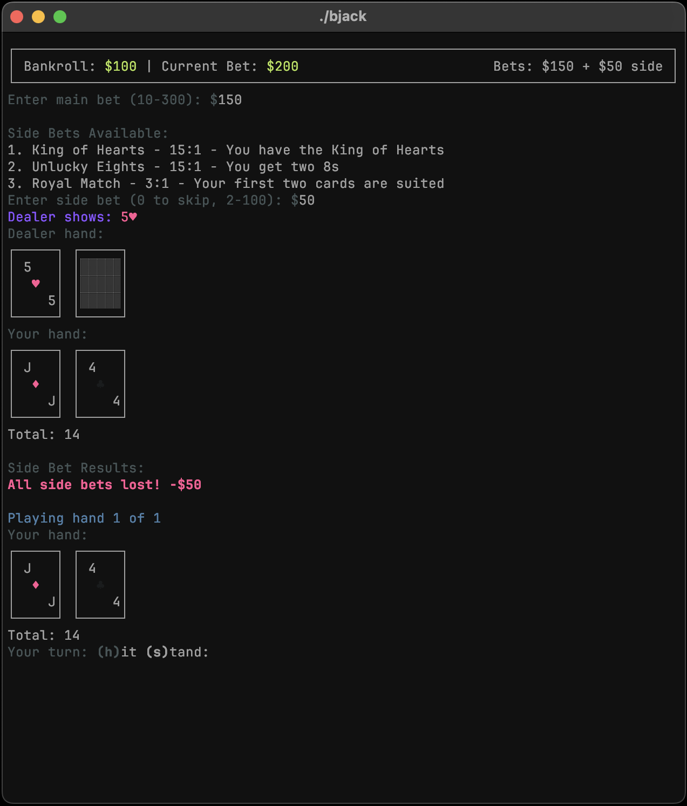

# BJack - Blackjack CLI Game


A feature-rich, customizable blackjack game for the terminal built with Crystal.
<div align="center">
  
  
  <p><i>BJack in action</i></p>
</div>

## Features
- 🎮 Full-featured blackjack gameplay with Vegas-style rules
- 🎨 Beautiful terminal UI with ASCII card art and colors
- 💰 Customizable table limits and rules
- 🎲 Multiple side bet options
- 🃏 Support for multiple decks, splits, doubling, surrender and insurance
- ⚙️ Extensive configuration options via command-line arguments

## Installation

### From Source
You first need to install the [Crystal](https://crystal-lang.org/install/) programming language :sweat_smile:. It's a fun language, try it out :shrug:.
```bash
git clone https://github.com/yourusername/bjack.git
cd bjack
shards build --release
```
The compiled binary will be available at `bin/bjack`.

### Quick Start
```bash
# Start with default settings
./bin/bjack

# Start with custom settings
./bin/bjack --cash 500 --minbet 25 --decks 8 --hit-soft17 --surrender
```

## Game Rules

### Basic Rules
- Dealer stands on hard 17 and above (configurable to hit on soft 17)
- Blackjack pays 3:2 (configurable)
- Min bet: $10, Max bet: $500 by default (configurable)
- Starting bankroll: $300 by default (configurable)

### Some Advanced Features
- Split up to 3 hands (configurable)
- Double down on any two cards
- Insurance when dealer shows an Ace
- Surrender option (when enabled)
- Dealer peeks for blackjack (configurable)

## Command-line Options
| Option | Description | Default |
|--------|-------------|---------|
| `--cash CASH` | Starting bankroll | 300 |
| `--minbet MIN` | Minimum bet | 10 |
| `--maxbet MAX` | Maximum bet | 500 |
| `--hit-soft17` | Dealer hits on soft 17 | false |
| `--surrender` | Allow surrender | false |
| `--insurance` | Allow insurance | false |
| `--max-splits NUM` | Maximum splits allowed | 3 |
| `--double-split` | Allow double after split | false |
| `--no-peek` | Dealer does not check hole card for blackjack | false |
| `--decks NUM` | Number of decks used | 6 |
| `--side-bets NUM` | Number of side bets | 3 |
| `--pay PAY` | Blackjack payout (e.g. 6:5) | 3:2 |

### UI Options
| Option | Description | Default |
|--------|-------------|---------|
| `--no-colors` | Disable colored output | false |
| `--no-ascii` | Disable ASCII card art | false |
| `--no-clear` | Don't clear screen between rounds | false |
| `--compact` | Use compact UI mode | false |
| `--no-single-key` | Disable single-key input | false |

## Available Side Bets
The game randomly selects from the following side bets:
- **Mixed Pairs** (3:1) - Your two cards are a mixed pair
- **Perfect Pairs** (10:1) - Your two cards are a perfect pair
- **21+3** (6:1) - Your first two + dealer's upcard form a flush, straight, or three-of-a-kind
- **Royal Match** (3:1) - Your first two cards are suited
- **Super Sevens** (3:1) - You have at least one 7
- **Lucky Lucky** (4:1) - Your two cards plus dealer's upcard total 19-22
- **Hard In-Between** (4:1) - Dealer's upcard is between your two cards
- **Suited Blackjack** (20:1) - Your blackjack is suited
- And many more!

## Gameplay Control
During gameplay, use the following keys:
- `h` - Hit
- `s` - Stand
- `d` - Double (when available)
- `p` - Split (when available)
- `u` - Surrender (when enabled)
- `y/n` - Yes/No responses

## Contributing
I have been thinking of adding a **multiplayer mode** and a **chat room**. But too lazy to get to it.
1. [Fork it](<https://github.com/rkv0id/bjack/fork>)
2. Create your feature branch (`git checkout -b my-new-feature`)
3. Commit your changes (`git commit -am 'Add some feature'`)
4. Push to the branch (`git push origin my-new-feature`)
5. Create a new Pull Request

## License
This project is available under the MIT license. See the [LICENSE](LICENSE) file for more info.

## Acknowledgements
- Built with [Crystal](https://crystal-lang.org/):heart:, a statically-typed, compiled language with Ruby-like syntax
